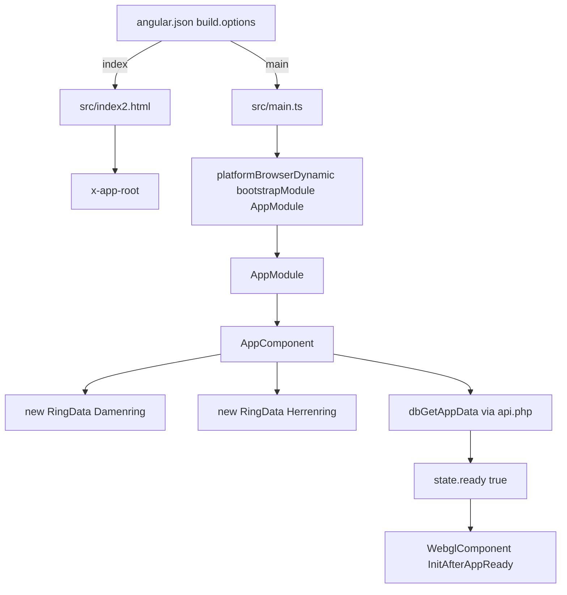
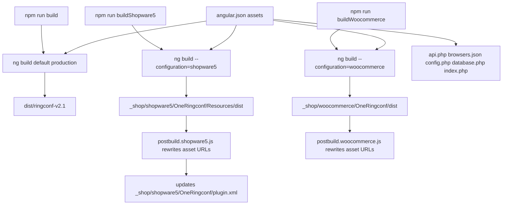

# Runtime and Data Flow

Diese Datei beschreibt den statisch verifizierten Laufzeit- und Datenfluss. Build- und Laufzeitverhalten wurde nicht ausgefuehrt, weil die lokale Umgebung Node `v20.16.0` statt einer fuer Angular 15 kompatiblen Node-18-Laufzeit nutzt.

## Bootstrapping



Belege: `angular.json`, `src/index2.html`, `src/main.ts`, `src/app/app.module.ts`, `src/app/app.component.ts`.

## Angular-Laufzeit

`AppComponent` initialisiert globale Zustandsobjekte, Query-Parameter und zwei `RingData`-Instanzen. `WebglComponent` wartet im Konstruktor per `setInterval()` auf `AppComponent.app.state.ready`. Danach wird die Babylon Engine erzeugt, Assets werden via `Preload.load()` geladen, und fuer jede `RingData`-Instanz entsteht ein `cRing`.

Navigation ist Hash-basiert, nicht Angular-Router-basiert. `MenuComponent` setzt Hashes, `ConfigComponent` rendert anhand `navigation.currentHash` die jeweilige View.

## UI zu Zustand zu Babylon Renderer

```mermaid
flowchart LR
  A[User input in Config components] --> B[RingData setters or static mutators]
  B --> C[RingData.isDirty true]
  C --> D[cRing setInterval detects dirty]
  D --> E[cRing.compute preComputeMeshes]
  E --> F[stoneCalc and geometry generation]
  F --> G[dispose old meshes]
  G --> H[new Babylon Meshes, Materials, ThinInstances]
  H --> I[WebglComponent.renderFrame forceFrames]
  I --> J[Scene render]
  J --> K[Canvas #webgl]
```



Typische Beispiele:

| UI | Mutation | Renderer-Effekt |
|---|---|---|
| `ConfigDimensionComponent` | `RingData.ringWidth`, `ringHeight`, `ringSize` | Geometrie, Kamera-Ziel |
| `ConfigProfileComponent` | `RingData.profileName` | Profil-JSON/Querschnitt |
| `ConfigMaterialComponent` | `RingData.setMaterial`, `setFineness`, `setSurface` | PBR-Material/DynamicTexture |
| `ConfigGapComponent` | `gapMode`, `gapWidth`, `gapDiv`, `stepMode` | Fugen-/Stufengeometrie |
| `ConfigStoneComponent` | `RingData.setStone*` | Steinpositionen, Meshes, ThinInstances |
| `ConfigDiamondComponent` | `webglSettings.environmentPreset` | Shader-Uniforms/Environment |

## Asset Loading

`Preload.load()` nutzt Babylon `AssetsManager`:

1. Profil-JSON: `environment.assetFolderLocation + "/assets/obj/profile/json/" + profile.name + ".json"`.
2. Oberflaechentexturen: `environment.assetFolderLocation + "/assets/img3d/" + surface.material.file`.
3. Stein-OBJ: `environment.assetFolderLocation + "/assets/obj/stone/" + stoneType.obj`.
4. Krabbe-Mesh: `assets/obj/stone/krabbe_einzeln.obj`.

`WebglComponent` laedt zusaetzlich `envTextureKeyShot.env`, `tex_shadow.png` und Diamant-/Shaderbilder.

## Save und Load

```mermaid
sequenceDiagram
  participant UI as UI/Tools/SaveLoad
  participant App as AppComponent dbSavePreset/dbLoadPreset
  participant WebGL as WebglComponent
  participant PHP as src/php/api.php
  participant DB as MySQL tables

  UI->>App: onSave
  App->>WebGL: createScreenshot(600)
  WebGL-->>App: base64 image
  App->>App: clear RingData.list[0/1].stone[0].odm
  App->>PHP: POST rpc=dbSavePreset rpp=[id,preset0,preset1,img,false]
  PHP->>DB: INSERT/UPDATE ringcfg_2v1_preset
  DB-->>PHP: stored row or suffix id
  PHP-->>App: {errorCode,id,overwrite}
  App->>App: state.preset_id=id; localStorage.ringconfId=id

  UI->>App: onLoad(id)
  App->>PHP: POST rpc=dbLoadPreset rpp=[id]
  PHP->>DB: SELECT preset row and related ids
  PHP-->>App: {errorCode,id,preset_0,preset_1,img,dbItems}
  App->>App: RingData.list[n].clone(JSON.parse(preset_n))
  App->>WebGL: dirty loop recomputes
```

Kompatibilitaetsvertrag: ID-Format `XXXX-XXXX` plus optionale Suffixe, Standardpreset `0000-0000`, JSON-Felder der `RingData`-Instanzen inklusive fuehrender `_`-Namen.

## Preset und AppData

AppData-Quellen:

| Quelle | Verwendung |
|---|---|
| `AppComponent.data` | eingebetteter Fallback und initiale Struktur |
| `config_vonjacob.de_20250226.json` | externe Konfiguration/Export, statisch vergleichbar |
| PHP `dbGetAPPDATA` | ersetzt `AppComponent.app.data`, falls DB-Daten vorhanden |
| Admin/Diamond Komponenten | koennen AppData/Environment-Presets speichern/importieren |

Bei `dbGetAppData()` wird bei leerer Antwort `dbSetAppData()` mit `dataSafeJson` ausgeloest und die eingebettete AppData genutzt.

## PHP/API

Die TypeScript-Seite baut Requests ueber:

| Funktion | Datei | Vertrag |
|---|---|---|
| `getDistRootUrl()` | `src/app/app.component.ts` | Standalone/Woo `api.php`, Shopware `api`; lokale `192.168` Hosts auf Port `8081` |
| `makeHttpHeaders()` | `src/app/app.component.ts` | `Content-Type: application/x-www-form-urlencoded`, `X-CSRF-TOKEN` aus DOM/Cookie |
| `makeHttpParams()` | `src/app/app.component.ts` | `rpc`, `rpp` JSON, `tabId` |

PHP `api.php` merged `$_GET` und `$_POST`, ruft eine Methode gleichen Namens auf und gibt JSON aus. Es gibt keine statisch belegte serverseitige CSRF-/Auth-Pruefung.

## Shopware und WooCommerce



Hinweis: `_shop/**` fehlt im Checkout. Die Diagrammzweige sind statisch aus `angular.json` und Postbuild-Skripten abgeleitet, nicht durch Build verifiziert.

## Fehler- und Fallbackpfade

| Pfad | Verhalten | Risiko |
|---|---|---|
| fehlende AppData in DB | TS ruft `dbSetAppData()` auf und nutzt eingebettete Daten | mutiert Backend bei erstem Start |
| fehlendes Preset | PHP versucht `0000-0000`; sonst Errorcodes `-1`/`-2` | Standardpreset kritisch |
| inkompatibles Profil/Stein | `cRing` reduziert Werte oder setzt Steinmodus `0` | Kunden koennen Besatz verlieren |
| WebGL Context Loss | `engine.doNotHandleContextLost = true` | keine Recovery |
| Asset Load Error | `failed++`, nur console log, callback nur bei `failed === 0` | App kann ohne klaren UI-Fehler haengen |
| PHP DB Fehler | `database.php` printet PDO-Fehler und `die()` | Informationsleck |
| Shopstruktur fehlt | Postbuild liest nicht vorhandene Verzeichnisse/Plugin XML | Build bricht spaet |
