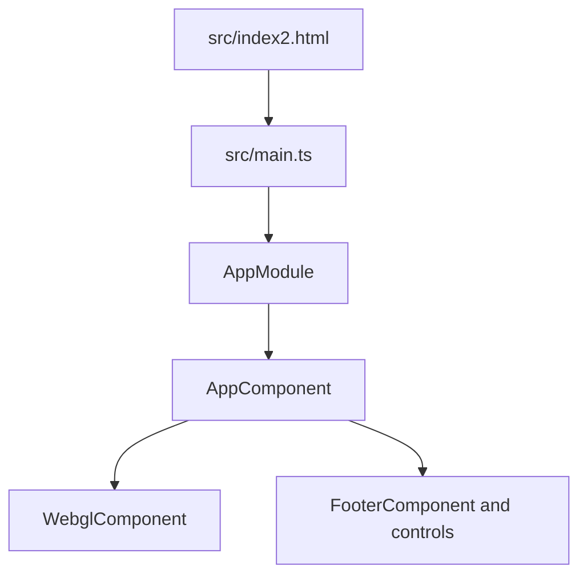
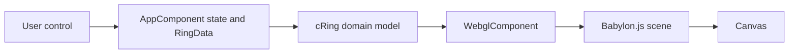
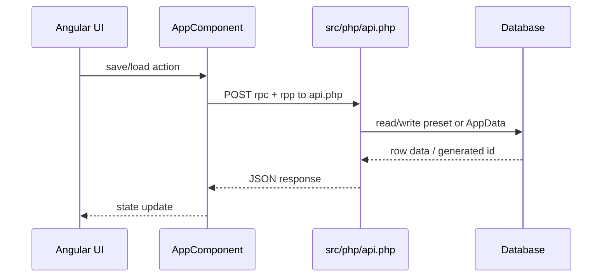
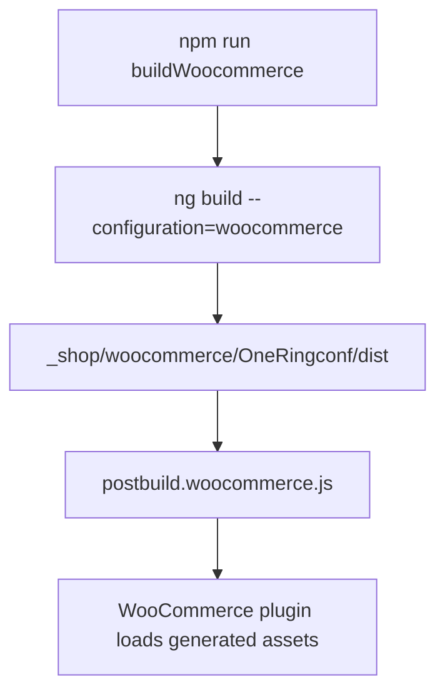
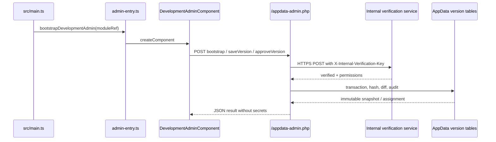

# Runtime And Data Flow

This document describes the current supported runtime shape after removing legacy shop-specific branches. Standalone and WooCommerce are the supported modes.

## Bootstrap

`src/main.ts` still uses the classic NgModule bootstrap through `platformBrowserDynamic().bootstrapModule(AppModule)`. There is no Angular Router.

## UI To Renderer

`AppComponent`, `RingData`, `cRing`, and `WebglComponent` remain the compatibility-sensitive state/rendering path. The current branch does not redesign that architecture.

## Save And Load

`getDistRootUrl()` now resolves the PHP bridge as `api.php` for all supported modes. Existing preset IDs and suffix behavior remain unchanged.

## WooCommerce Build And Deployment

The WooCommerce plugin source tree is still created in the next phase. Generated files under `_shop/woocommerce/OneRingconf/dist` are ignored.

## Add-To-Cart Boundary

The former direct shop form submission has been removed. `addToCart()` now saves the current preset through `dbSavePreset(true)` and dispatches `oneringconf:add-to-cart` in WooCommerce mode with `presetId` and `rings` in `detail`. The future plugin integration must consume that event or provide a documented alternative without changing preset contracts silently.

## Failure Paths

- Missing PHP DB configuration now throws a clear `Missing ONERINGCONF_DB_DSN configuration` server error.
- API calls still depend on the legacy RPC dispatcher in `src/php/api.php`.
- WebGL lifecycle and context-loss risks remain as documented in `risk-register.md`.

## Development AppData Admin Flow

The AppData/WebGL admin is mounted from `src/main.ts` by calling `bootstrapDevelopmentAdmin(...)`. In the `development` build this resolves to `src/app/development-admin/admin-entry.ts`, which creates `DevelopmentAdminComponent` outside the main `AppModule` template. Production and WooCommerce replace that file with `admin-entry.disabled.ts`, so admin components and labels do not enter those dependency graphs.

`AppDataAdminService` only uses relative `/appdata-admin.php` requests. Login and PIN are in-memory dialog fields, sent in JSON request bodies for sensitive actions, then cleared. They are never stored in browser storage.

The local endpoint implements the versioning contract from `ringcfg_appdata_build`, `ringcfg_appdata_version`, `ringcfg_appdata_build_compatibility`, `ringcfg_appdata_target`, `ringcfg_appdata_release_history`, and `ringcfg_appdata_audit_log`. It keeps the legacy `TABLE_DATA/appdata` entry as runtime fallback and only mirrors an assigned snapshot back there for the `local-development` target.

The canvas build label is now a build/AppData pair: `WebglComponent.getBuildString()` renders `Build <build> · AppData <version>`. `AppComponent.state.appDataVersionLabel` is updated by the development admin when a versioned snapshot is loaded.
