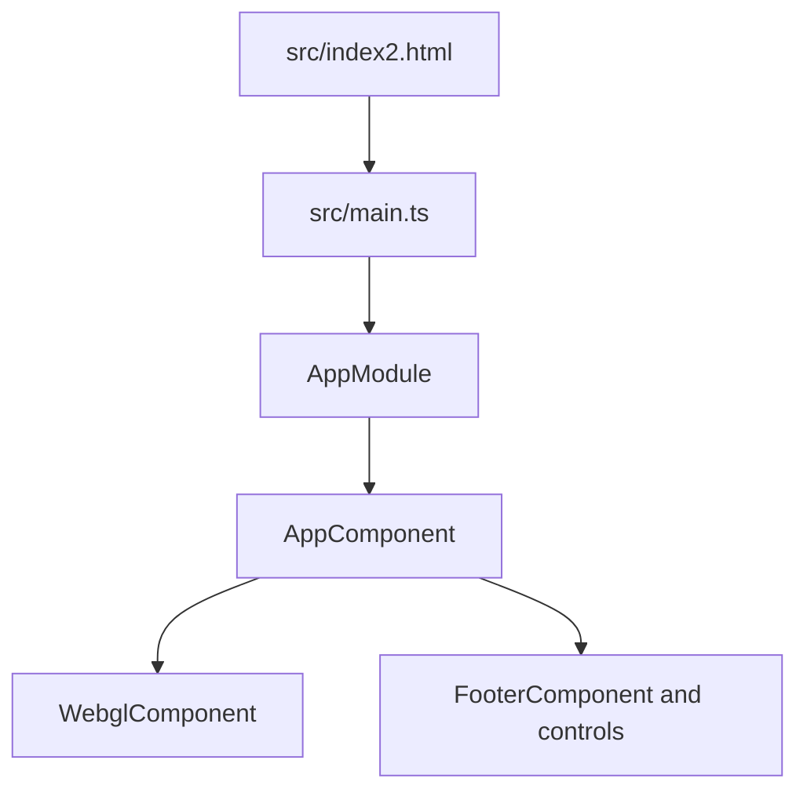
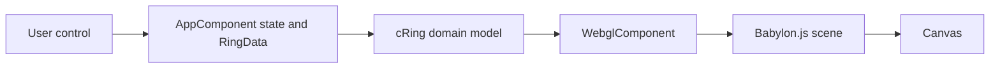
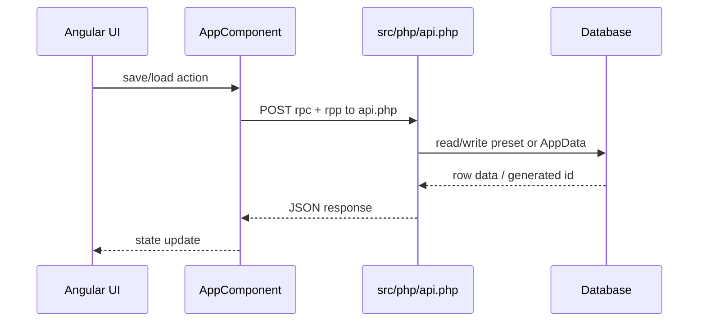
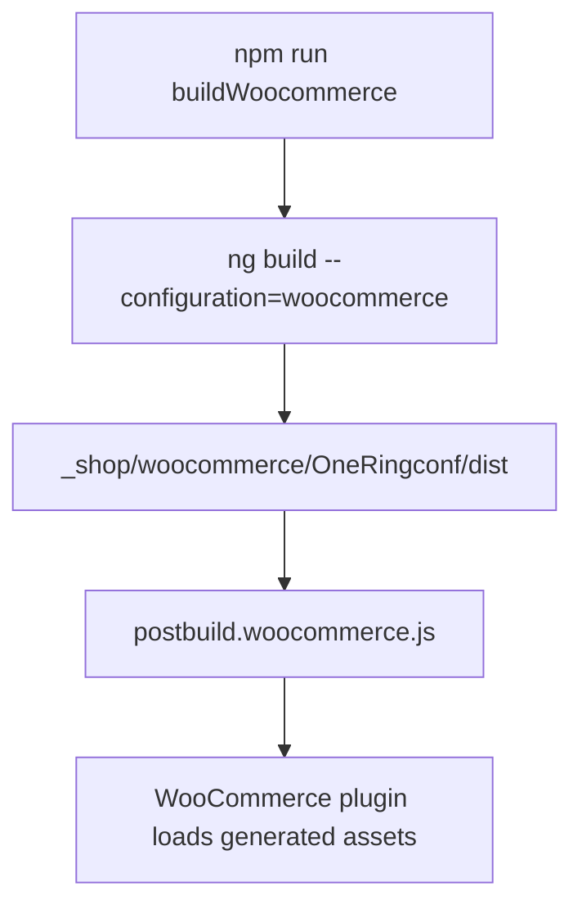

# Runtime And Data Flow

This document describes the current supported runtime shape after removing legacy shop-specific branches. Standalone and WooCommerce are the supported modes.

## Bootstrap

`src/main.ts` still uses the classic NgModule bootstrap through `platformBrowserDynamic().bootstrapModule(AppModule)`. There is no Angular Router.

## UI To Renderer

`AppComponent`, `RingData`, `cRing`, and `WebglComponent` remain the compatibility-sensitive state/rendering path. The current branch does not redesign that architecture.

## Save And Load

`getDistRootUrl()` now resolves the PHP bridge as `api.php` for all supported modes. Existing preset IDs and suffix behavior remain unchanged.

## WooCommerce Build And Deployment

The WooCommerce plugin source tree is still created in the next phase. Generated files under `_shop/woocommerce/OneRingconf/dist` are ignored.

## Add-To-Cart Boundary

The former direct shop form submission has been removed. `addToCart()` now saves the current preset through `dbSavePreset(true)` and dispatches `oneringconf:add-to-cart` in WooCommerce mode with `presetId` and `rings` in `detail`. The future plugin integration must consume that event or provide a documented alternative without changing preset contracts silently.

## Failure Paths

- Missing PHP DB configuration now throws a clear `Missing ONERINGCONF_DB_DSN configuration` server error.
- API calls still depend on the legacy RPC dispatcher in `src/php/api.php`.
- WebGL lifecycle and context-loss risks remain as documented in `risk-register.md`.
